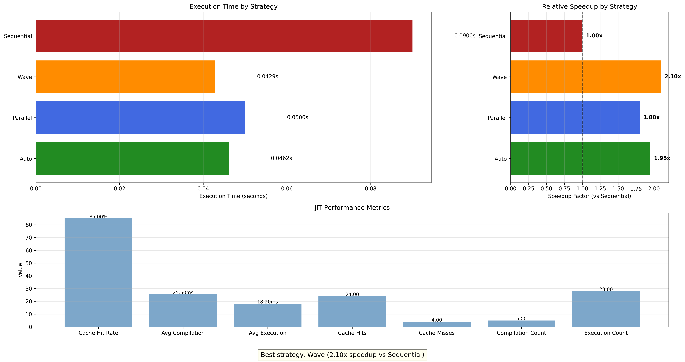

# Ember Acceleration Strategies

This document describes the acceleration strategies available in Ember's XCS execution engine and provides guidance on choosing the right approach for different workloads.

## Overview

Ember's XCS module provides several complementary strategies for accelerating LLM workflows:

1. **JIT Compilation Strategies**
   - **Trace-based JIT**: Traditional execution trace recording and replay
   - **Structural JIT**: Analysis of operator structure for optimization
   - **Enhanced JIT**: Advanced analysis combining tracing and structural patterns

2. **Execution Schedulers**
   - **Sequential**: Basic topological order execution
   - **Parallel**: General-purpose parallel execution
   - **Wave**: Optimized wave-based parallel execution for complex workflows
   - **Auto**: Intelligent scheduler selection based on workload characteristics

3. **Transformation Strategies**
   - **vmap**: Vectorized mapping across batched inputs
   - **pmap**: Parallelized execution across devices
   - **mesh_sharded**: Device mesh-based sharding for large models

## How Execution Options Work

The XCS execution system reads options in this priority order:

1. Explicit parameters passed to `execute_graph()`
2. Context-specific options set via `with execution_options(...)`
3. Thread-local options inherited from outer contexts
4. Global defaults set via `set_execution_options()`

## Scheduler Comparison

| Scheduler   | Best For                          | Worker Control    | Parallelism Detection |
|-------------|-----------------------------------|-------------------|------------------------|
| Sequential  | Debugging, predictable execution  | N/A               | None                   |
| Parallel    | Independent operations            | `max_workers`     | Basic                  |
| Wave        | Complex dependency structures     | `max_workers`     | Advanced wave-based    |
| Auto        | General-purpose workflows         | `max_workers`     | Dynamic strategy       |

## Common Usage Patterns

### Basic Usage

```python
from ember.xcs.engine.execution_options import execution_options

# Default behavior with automatic parallelization
result = my_operator(inputs=data)

# Force sequential execution for debugging
with execution_options(scheduler="sequential"):
    result = my_operator(inputs=data)
    
# Explicit parallel execution with worker control
with execution_options(scheduler="parallel", max_workers=4):
    result = my_operator(inputs=data)
```

### JIT Compilation

```python
from ember.xcs import jit

# Auto-select best JIT strategy
@jit
class MyOperator(Operator):
    def forward(self, *, inputs):
        return {"result": process(inputs)}
        
# Force specific JIT strategy
@jit(mode="enhanced")
class AdvancedOperator(Operator):
    def forward(self, *, inputs):
        return {"result": process(inputs)}
```

### Transformations

```python
from ember.xcs.transforms import vmap, pmap

# Vectorize a function for batch processing
batch_fn = vmap(single_item_fn, batch_size=16)

# Parallelize execution across workers
parallel_fn = pmap(compute_fn, max_workers=4)

# Compose transformations
from ember.xcs.transforms.transform_base import compose
vectorized_parallel = compose(vmap(batch_size=32), pmap(max_workers=4))
```

### Advanced Execution Control

```python
# Complete execution control with multiple options
with execution_options(
    scheduler="wave",           # Use wave-based scheduling
    max_workers=8,              # Set worker thread count
    enable_caching=True,        # Enable intermediate result caching
    device_strategy="auto",     # Auto-select execution device
    trace_execution=True,       # Enable execution tracing
    collect_metrics=True        # Collect performance metrics
):
    result = complex_operator(inputs=data)
```

## Performance Optimization Guide

### When to use Sequential Execution
- During debugging to make execution predictable
- For simple linear operations with no parallelism opportunities
- When troubleshooting race conditions or thread-safety issues

### When to use Parallel Execution
- For simple parallelizable workloads
- When you know operations are independent
- For ensemble models running the same prompt on different models

### When to use Wave-based Execution
- For complex operator pipelines with multiple stages
- When workloads have mixed parallel/sequential sections
- For nested operator structures with complex dependencies

### When to use Auto Execution
- As a default for general-purpose workloads
- When execution patterns are unknown or variable
- For applications where adaptivity is more important than perfect optimization

## Performance Measurement

To measure the performance impact of different strategies, use:

```python
from ember.xcs.jit import get_jit_stats

# Get statistics for a JIT-compiled function
stats = get_jit_stats(my_function)
print(f"Compilation time: {stats.get('compilation_time', 0):.4f}s")
print(f"Execution time: {stats.get('execution_time', 0):.4f}s")
```

## Best Practices

1. **Use JIT wherever possible** - Especially for complex operators with multiple sub-operators
2. **Let auto-selection work first** - The auto-mode is designed to make good choices
3. **Measure before optimizing** - Get baseline performance before trying different strategies
4. **Consider both CPU and GPU constraints** - Optimal settings vary by hardware
5. **Tune worker counts based on workload** - More workers isn't always better
6. **Enable caching for repeated operations** - Significant speedup for repeated patterns



The chart above demonstrates the relative performance of different scheduling strategies on a representative ensemble operator workload, showing how parallelization can significantly reduce execution time for suitable workloads.